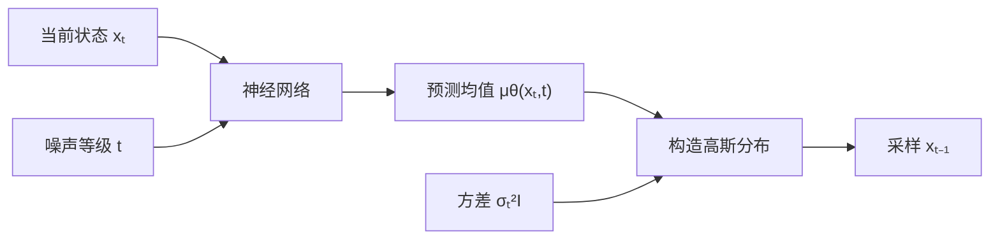
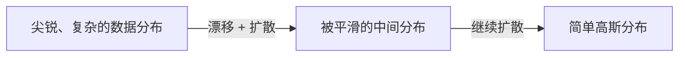
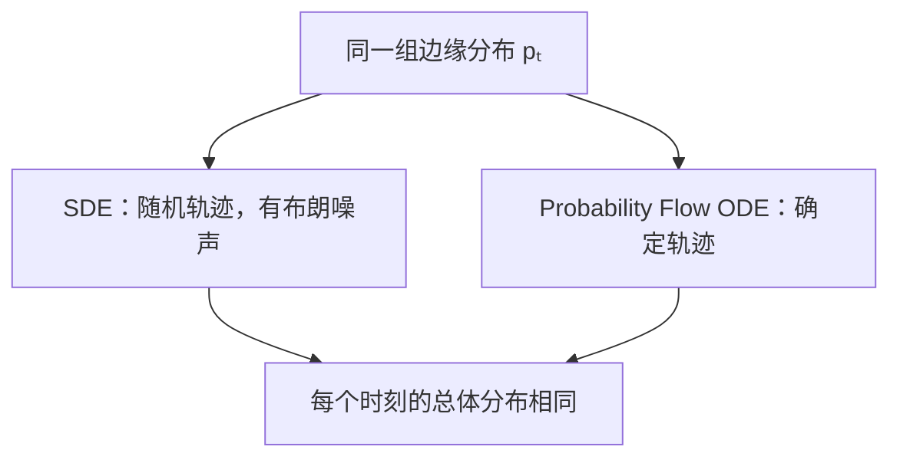
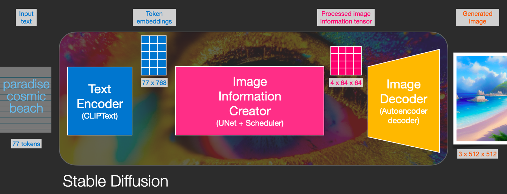
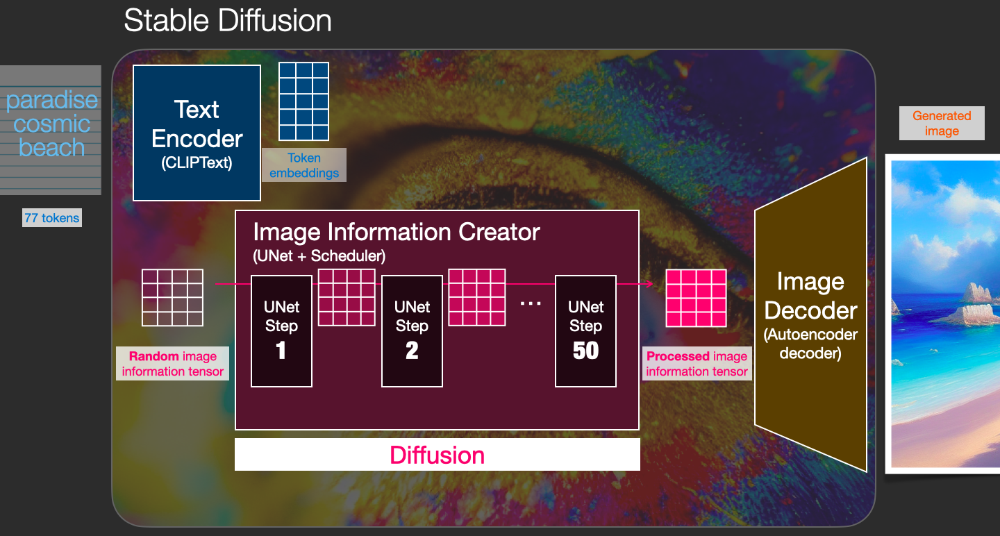
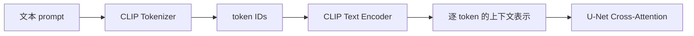

Diffusion是一场大型数学推演。

不是学会学不会的问题，而是让我可以记住它！

究竟什么东西可以使人永生难忘，比如69秀。但diffusion没有这么刺激，我们只能另寻他路。

也就是通过透彻的理解来记住。

# Diffusion的生成原理
很简单
1. 前向过程：从图片到噪声，持续破坏
2. 后向过程：从噪声到图片，恢复其原始分布
复杂图片分布 -> 平滑高斯分布 -> 复杂图片分布

从$x_0$逐渐变成了$x_t$：一只猫->猫的轮廓->微弱的统计线索->几乎没有任何原图的信息

# 为什么要费这么大劲搞成纯噪声

本质目的是：在复杂的数据分布和一个容易采样的简单分布之间，建立一条可以学习的连续路径。

需要先澄清一个容易误解的说法：如果只给一个与$x_0$完全独立的噪声，并让确定性网络用MSE一步预测$x_0$，那么最优解确实会退化为数据的无条件均值。但Diffusion本来就是从纯噪声开始生成的，它没有退化，是因为它学习的不是“一步从噪声猜出图片”，而是一系列带时间条件的局部反向转移。

## 必须以接近纯噪声为中间点

如果中间点保留了一部分图片信息，而非纯洁的噪声
$$x_T=0.5x_0+0.5\epsilon$$

那么真实推理时，我们无法在没有$x_0$的情况下直接采样这个终点。让$q(x_T)$接近一个已知的$\mathcal N(0,I)$，才能在生成时从同一个分布出发。

## 噪声的流向
所以噪声和信息量其实是两个概念，噪声并不等于没有信息量。

先统一全文符号：

$$
\beta_t=\text{第}t\text{步加入的噪声比例},\qquad
\alpha_t=1-\beta_t,\qquad
\bar\alpha_t=\prod_{s=1}^{t}\alpha_s
$$

从$x_0$直接采样$x_t$的闭式公式是：

$$
x_t = \sqrt{\bar\alpha_t} x_0
+ \sqrt{1-\bar\alpha_t}\epsilon
$$

噪声大小和保留原图的信息量，是相关而不等价的状态。

Diffusion的前向过程中：
$$I(x_0;x_0)\geq I(x_0;x_1)\geq...\geq I(x_0;x_T)\approx 0$$
根据数据处理不等式，互信息不会增加；是否严格减小则取决于具体噪声过程。

纯噪声仍然有自己的熵：
$$H(\epsilon)>0$$

“有熵”和“还保留原图信息”不是一回事。终点噪声可以自身非常随机，同时和某一张原图几乎独立。

那怎么知道往哪里走？（t时间后变回一个图片）

从diffusion的训练设计或者网络所学到的，其实是：
$$s_\theta(x_t, t)\approx \nabla_{x_t}\log p_t(x_t)$$
score给出当前位置的局部对数密度梯度。它不保证走向“最近”的某个模式，而是和反向SDE或ODE一起构成完整的生成动力学，使整体样本分布逐步回到数据分布。

这里细节我们都先不细究。

# 加噪具体做了什么？

**既然了解了为什么要让一个图变成噪声，我们就开始把它变成噪声！**


1. 设定真实图片分布为 $x_0$
$$
x_0\sim p_{\text{data}}(x)
$$

2. 最简单的加噪方式如下：
$$
x_t=a_t x_0 + b_t \epsilon, \qquad \epsilon\sim\mathcal N(0, I)
$$
很明显 $a_t$ 控制保留多少原始信号，$b_t$ 控制加入多少噪声

3. 在假设数据各维已经近似零均值、单位方差，并且与噪声独立时，规定$$a^2_t+b^2_t=1$$可以让各维的总体方差近似保持稳定。这样就得到了我们最初的公式：

$$x_t = \sqrt{\bar\alpha_t} x_0 + \sqrt{1-\bar\alpha_t}\epsilon$$

直观的理解是，损失多少信号，就补入多少噪声。

**为什么不写成$t-1$和$t$之间的关系呢？：这是因为线性高斯转移可以合并成闭式分布。** 这里有兴趣可以拆到链上推导，这是DDPM的第一个核心公式。训练时可以随机抽一个$t$，不需要真的迭代加噪$t$次。本质上，它描述的是信号与噪声的比例。

**如果前向可以一步采样，为什么反向还要拆成$t$步？** 训练时$\epsilon$是我们亲手采样的，因此它并非不可得。真正的原因是：从几乎独立的$x_T$一步预测$x_0$是高度多模态的全局问题，而许多较小的反向转移更接近局部问题，也更容易用简单分布建模。


加噪的过程就是这么简单。可以看到：加噪过程是一个定义明确的马尔科夫链。


可以看到$t$是一个很重要的变量，我们并不训练一个忽略噪声等级的单步还原器。


# 去噪会怎么去？
DDPM的全称是Denoising Diffusion Probabilistic Models。可以看出去噪才是真正的核心。Ho、Jain和Abbeel在[2020年的DDPM论文](https://arxiv.org/abs/2006.11239)中让这一方向获得了广泛关注，但Diffusion生成模型并不是从这里才开始；Sohl-Dickstein等人在[2015年的工作](https://arxiv.org/abs/1503.03585)中已经提出了基于非平衡热力学的扩散生成方法。

虽然我们知道我们实际使用的 $\epsilon$，但我们不会告诉去噪模型。否则就直接完成求解得到$x_0$了，而是用模型去逼近。

**这是一道我们自己出的题，噪声是我们亲手加的，自然知道答案是什么。**

神经网络本质是一个黑盒函数，我们训练该网络来逼近$\epsilon$，相当于我们自己造出了训练样本：
$$\epsilon_\theta(x_t,t)$$
最常见的优化目标如下：
$$\mathcal L = \mathbb E_{x_0, t, \epsilon} \left[ \left \| \epsilon - \epsilon_\theta(x_t, t) \right \|_2^2\right]$$

即对于大量样本的噪声各维度误差之和后计算期望

# Diffusion和VAE
在VAE中，我们写作$$x\rightarrow z \rightarrow \hat x$$
而diffusion则引入了一串潜变量$$x_0\rightarrow x_1 \rightarrow ...\rightarrow x_T$$
其中前向过程写作
$$q(x_{1:T}|x_0)=\prod^T_{t=1}q(x_t|x_{t-1})$$
去噪模型则进行反向分解
$$p_\theta(x_{0:T})=p(x_T)\prod^T_{t=1}p_\theta(x_{t-1}|x_t)$$
其中$$p(x_T)=\mathcal N(0,I)$$
对于VAE来说，$z$是单层或少量潜变量，常见VAE通常采用标准高斯先验$p(z)=\mathcal N(0,I)$，同时学习近似后验$q_\phi(z\mid x)$。经典DDPM则引入一整条潜变量链。VAE和经典DDPM都可以从ELBO出发推导训练目标，但现代score matching与flow matching训练并不都需要直接优化ELBO。

DDPM论文将模型描述为受非平衡热力学启发的潜变量模型，并把变分下界与去噪score matching联系起来。它与VAE都使用变分思想，但潜变量结构和具体ELBO分解并不相同。

# 让加噪和去噪过程神经网络可训练：Diffusion的ELBO求解
## 从最大似然到 KL 散度
训练生成模型最自然的出发点，是让真实样本的对数似然 `\log p_\theta(x_0)` 尽可能大。但在 Diffusion 中，生成路径包含整条潜变量链，计算样本概率需要把所有中间状态积分掉：

$$
p_\theta(x_0)=\int p_\theta(x_{0:T})\,dx_{1:T}
$$

这个高维积分通常无法直接计算。好在前向加噪分布 `q(x_{1:T}\mid x_0)` 已知，可以用它重写似然，再利用 `\log` 的凹性得到一个可优化的下界：

$$
\log p_\theta(x_0)
\ge
\mathbb E_{q(x_{1:T}\mid x_0)}
\left[
\log\frac{p_\theta(x_{0:T})}{q(x_{1:T}\mid x_0)}
\right]
=\mathrm{ELBO}
$$

这里不必纠结每一步代数。关键是：原本难算的边缘似然，被换成了可以从已知前向过程采样估计的目标。期望中的对数分布比值正是 KL 散度的形式；它衡量模型反向分布与真实反向后验之间还有多大差距。

对完整的 $T$ 步过程，负 ELBO 可以概括成：

$$
-\mathrm{ELBO}=L_T+\sum_{t=2}^{T}L_{t-1}+L_0
$$

- $L_T$：终点分布是否接近预设的标准高斯。
- $L_{t-1}$：模型的每一步反向转移，是否接近真实反向后验。
- $L_0$：最后一步能否重建回数据 $x_0$。

第一项由前向噪声日程决定，训练主要作用于后两类包含模型参数的项。因此主线可以记成：**最大似然难以直接计算 → 优化 ELBO → 匹配每一步反向分布 → 在高斯假设下进一步化成 MSE。**
## 从KL散度到MSE
这里我们做一个设定，用一个高斯分布描述从$x_t$到x_{t-1}的随机过程
$$p_\theta(x_{t-1}|x_t) = \mathcal N(x_{t-1};\mu_\theta(x_t,t),\sigma^2_tI)$$
这里用人话讲就是：给定当前的带噪状态$x_t$，$x_{t-1}$也应该服从高斯分布，而这个高斯分布的均值通过神经网络预测，而方差通过$\sigma^2_tI$来描述。

这个式子对我的难点在于高斯分布的写法。$\mathcal N(x;\mu,\Sigma)$表示“把$x$看作随机变量，它服从均值为$\mu$、协方差为$\Sigma$的高斯分布”。

为什么用高斯建模这个条件概率？前向转移是高斯的，并且在已知$x_0$时，反向后验也具有下面的解析高斯形式：
$$
q(x_{t-1}\mid x_t,x_0)
=
\mathcal N
\left(
x_{t-1};
\tilde\mu_t(x_t,x_0),
\tilde\beta_t I
\right)
$$

前向小步是高斯转移；当每一步足够小时，对应的反向条件分布可以用高斯进行合理建模。这样既符合局部反向过程的结构，也让KL散度具有可解析形式，而不只是为了公式优雅。

神经网络在预测什么？
神经网络预测的是这个部分：$\mu_\theta(x_t,t)$
这个流程图可以非常形象地说明问题




这里对方差进行固定，两个高斯分布之间的KL散度就本质就是MSE，固定方差的含义是，不是让每一步的方差都相等，而是让方差和网络无关，可以通过规则获取（方差无非就是局部尺度），两个高斯分布之间的KL散度可以直接背公式：
$$
D_{\mathrm{KL}}
\left(
q\Vert p_\theta
\right)
=
\frac{1}{2\sigma_t^2}
\left\|
\tilde\mu_t-\mu_\theta
\right\|^2
+C
$$

这一步其实很简单，只需要把一维高斯密度写出来就可以推导出来。

再用噪声预测参数化反向均值：

$$
\boxed{
\mu_\theta(x_t,t)
=
\frac{1}{\sqrt{\alpha_t}}
\left(
x_t
-
\frac{\beta_t}{\sqrt{1-\bar\alpha_t}}
\epsilon_\theta(x_t,t)
\right)
}
$$

代入并整理，每个时间步的 KL 变成：

$$
L_t
=
\mathbb E
\left[
w_t
\left\|
\epsilon-\epsilon_\theta(x_t,t)
\right\|^2
\right]
+C
$$

其中 $w_t$ 只由噪声日程和反向方差决定。

DDPM 实践中常把复杂的时间权重去掉，采用：

$$
\boxed{
\mathcal L_{\mathrm{simple}}
=
\mathbb E
\left[
\|\epsilon-\epsilon_\theta(x_t,t)\|^2
\right]
}
$$
**至此，理论基础足以支持最简单的神经网络训练。**

接下来我们看更加深入的原理。
# 为什么预测噪声最终可以获得图片
## 为什么噪声预测会得到score

我们先看score的定义。

score是概率密度的方向，对于概率密度$p(x)$，定义:
$$
s(x)=\nabla_x\log p(x)
$$
它给出对数概率密度在当前位置上升最快的方向。

为什么学习score而非直接学习归一化后的$p(x)$？一个重要原因是它可以规避未知归一化常数。若：
$$
p(x)=\frac{\tilde p(x)}{Z}
$$
且$Z$与$x$无关，那么：
$$
\nabla_x\log p(x)
=
\nabla_x\log\tilde p(x)
$$


接下来我们看高斯加噪过程的条件score：

已知：
$$
q(x_{t}\mid x_0)
=
\mathcal N
\left(
\sqrt{\bar\alpha_{t}}x_0,
(1-\bar\alpha_{t})I
\right)
$$
对于高斯分布的score推导如下：
$$\mathcal N(x;\mu,\sigma^2I)$$
对于x的score为：
$$
\nabla_x\log \mathcal N(x;\mu,\sigma^2I)=-\frac{x-\mu}{\sigma^2}
$$

因此带入可以求得
$$
\nabla_{x_t}\log q(x_t\mid x_0)
=
-\frac{x_t-\sqrt{\bar\alpha_t}x_0}
{1-\bar\alpha_t}
$$

由：

$$
x_t-\sqrt{\bar\alpha_t}x_0
=
\sqrt{1-\bar\alpha_t}\epsilon
$$

得到：

$$
\boxed{
\nabla_{x_t}\log q(x_t\mid x_0)
=
-\frac{\epsilon}
{\sqrt{1-\bar\alpha_t}}
}
$$

这已经说明：预测噪声和预测条件 score 只差一个已知缩放系数和负号。

但这里还不能直接结束。因为上式是**条件score**：

$$
\nabla_{x_t}\log q(x_t\mid x_0)
$$

它依赖训练时已知的原图$x_0$。真正生成时，我们手里只有$x_t$，没有对应的$x_0$。反向SDE或ODE真正需要的是**边缘score**：

$$
\nabla_{x_t}\log q_t(x_t)
$$

其中$q_t(x_t)$表示把所有可能的原图都考虑进去后，时刻$t$的整体带噪数据分布。

## 从条件score到边缘score

### 边缘分布是所有条件分布的混合

先写出时刻$t$的边缘分布：

$$
q_t(x_t)
=
\int q(x_t\mid x_0)p_{\mathrm{data}}(x_0)\,dx_0
$$

直观上，每一张原图$x_0$经过加噪都会形成一个以$\sqrt{\bar\alpha_t}x_0$为中心的高斯分布；把数据集中所有原图对应的高斯混合起来，就得到$q_t(x_t)$。

现在对$x_t$求梯度：

$$
\nabla_{x_t}q_t(x_t)
=
\int p_{\mathrm{data}}(x_0)
\nabla_{x_t}q(x_t\mid x_0)\,dx_0
$$

利用恒等式：

$$
\nabla q=q\nabla\log q
$$

可以得到：

$$
\nabla_{x_t}q_t(x_t)
=
\int
p_{\mathrm{data}}(x_0)
q(x_t\mid x_0)
\nabla_{x_t}\log q(x_t\mid x_0)
\,dx_0
$$

两边除以$q_t(x_t)$：

$$
\nabla_{x_t}\log q_t(x_t)
=
\int
\frac{
p_{\mathrm{data}}(x_0)q(x_t\mid x_0)
}{
q_t(x_t)
}
\nabla_{x_t}\log q(x_t\mid x_0)
\,dx_0
$$

根据贝叶斯公式：

$$
\frac{
p_{\mathrm{data}}(x_0)q(x_t\mid x_0)
}{
q_t(x_t)
}
=
q(x_0\mid x_t)
$$

于是：

$$
\boxed{
\nabla_{x_t}\log q_t(x_t)
=
\mathbb E_{q(x_0\mid x_t)}
\left[
\nabla_{x_t}\log q(x_t\mid x_0)
\right]
}
$$

这就是从条件score到边缘score最关键的一步：

> 边缘score，等于在给定$x_t$后，对所有可能原图的条件score做后验平均。

这里的平均不是对整个数据集不加区别地平均。权重是$q(x_0\mid x_t)$：哪张原图更可能产生当前这个$x_t$，它对应的方向权重就更大。

### 把条件score换成噪声

前面已经得到：

$$
\nabla_{x_t}\log q(x_t\mid x_0)
=
-\frac{\epsilon}{\sqrt{1-\bar\alpha_t}}
$$

代入刚才的结论：

$$
\nabla_{x_t}\log q_t(x_t)
=
-\frac{
\mathbb E[\epsilon\mid x_t]
}{
\sqrt{1-\bar\alpha_t}
}
$$

因此：

$$
\boxed{
\nabla_{x_t}\log q_t(x_t)
=
-\frac{
\mathbb E[\epsilon\mid x_t]
}{
\sqrt{1-\bar\alpha_t}
}
}
$$

这时问题只剩下一个：神经网络用MSE预测噪声，学到的为什么正好是$\mathbb E[\epsilon\mid x_t]$？

### MSE的最优解是条件期望

训练目标是：

$$
\mathcal L
=
\mathbb E
\left[
\left\|
\epsilon-\epsilon_\theta(x_t,t)
\right\|^2
\right]
$$

固定某个$x_t$和$t$后，网络要选择一个预测值$a$，使下面的条件风险最小：

$$
a^*
=
\arg\min_a
\mathbb E
\left[
\|\epsilon-a\|^2
\mid x_t,t
\right]
$$

平方误差的最优解就是条件均值：

$$
\boxed{
\epsilon_\theta^*(x_t,t)
=
\mathbb E[\epsilon\mid x_t,t]
}
$$

所以训练完成后：

$$
\boxed{
s_\theta(x_t,t)
=
-\frac{
\epsilon_\theta(x_t,t)
}{
\sqrt{1-\bar\alpha_t}
}
\approx
\nabla_{x_t}\log q_t(x_t)
}
$$

至此逻辑链才真正闭合：

$$
\text{噪声MSE}
\Longrightarrow
\mathbb E[\epsilon\mid x_t,t]
\Longrightarrow
\text{边缘score}
\Longrightarrow
\text{反向生成所需的方向场}
$$

### 为什么网络不可能还原那一个真实噪声

只看到$x_t$时，通常存在许多不同的$(x_0,\epsilon)$组合都能产生它。因此网络无法知道训练时究竟抽中了哪一个$\epsilon$，它能学到的是这些可能噪声在后验分布下的均值。

这并不意味着最终生成的是“所有图片的平均图”。网络预测的是**当前位置上的平均去噪方向**，并且每走一步都会在新的位置重新计算方向。许多局部方向连续组合起来，才形成一条完整的生成轨迹。

顺带还可以推出$x_0$预测与score之间的关系。由：

$$
\mathbb E[\epsilon\mid x_t]
=
\frac{
x_t-\sqrt{\bar\alpha_t}\mathbb E[x_0\mid x_t]
}{
\sqrt{1-\bar\alpha_t}
}
$$

整理可得：

$$
\boxed{
\mathbb E[x_0\mid x_t]
=
\frac{
x_t+(1-\bar\alpha_t)\nabla_{x_t}\log q_t(x_t)
}{
\sqrt{\bar\alpha_t}
}
}
$$

这说明预测噪声、预测$x_0$和预测score并不是三件毫无关系的事，它们可以通过已知的噪声日程互相转换，只是参数化方式不同。

## 一个时刻的score并不足够
真正有能力的不是一个score而是整张动态概率地图。

我们明确一下：score并不是一个完整的生成器。上文只证明了单点如何爬山，但是整体如何走向最高峰并不确定。score想要成为生成器，必须依托于动力学：
- 初始样本来自于哪里？
- 时间向哪个方向走？
- 每一步要多快？
- 要不要保留随机扰动？
- 怎样整体概率质量提升？

[Score-Based Generative Modeling through SDEs](https://arxiv.org/abs/2011.13456)把这套关系统一到了SDE和ODE框架中。

diffusion中的t可以叫做时间，但更多是一个进度轴。
$$\text{数据结构丰富}\rightarrow\text{结构被噪声抹平}$$

将离散的小步加噪压缩成连续过程。

离散diffusion过程的另一种写法是：
$$X_{t+\Delta t} = X_t + f(X_t,t)\Delta t +g(t)\sqrt{\Delta t}\epsilon$$
其中第二项是确定性的漂移，而第三项是随机变化。

写成随机微分方程，而t足够小：
$$
\boxed{
dX_t
=
f(X_t,t)\,dt
+
g(t)\,dW_t
}
$$

这里：

- f(X_t,t) 是 drift，决定平均意义下往哪里漂移；
- g(t) 是 diffusion coefficient，决定噪声强度；
- $dW_t$ 是布朗运动的微小随机增量，其尺度约为$\sqrt{dt}$。

SDE的全称是Stochastic Differential Equation，即随机微分方程。
ODE的全称是Ordinary Differential Equation，即常微分方程。相比ODE，SDE多了随机扰动项。

DDPM的连续极限通常对应Variance Preserving SDE：
$$dX_t=-\frac{1}{2}\beta(t)X_tdt+\sqrt{\beta(t)}\,dW_t$$
它可以看作离散VP加噪过程的连续极限：前项逐渐衰减信号，后项持续注入噪声。

这里引入一个很重要的方程：Fokker–Planck方程，它描述整体分布如何变化。

单个样本遵循 SDE，而整体密度 \(p_t(x)\) 遵循 Fokker–Planck 方程：

$$
\boxed{
\partial_t p_t(x)
=
-\nabla\cdot\left(f(x,t)p_t(x)\right)
+
\frac12g(t)^2\Delta p_t(x)
}
$$

它包含两个效果：

- 漂移项把概率质量整体搬运；
- 扩散项把概率质量摊开、抹平。



这里出现了 Diffusion 最深的一个结构：它不仅在破坏单张图片，也在让整个概率分布逐渐变得光滑、连通和容易处理。

Fokker–Planck方程帮助我们理解：模型得到score之后，score如何进入动力学系统并改变整体概率分布。

这里的方案一是采用反向时间SDE，另一个选择是Probability Flow ODE。
反向时间SDE可以写成：

$$
dX_t=
\left[
f(X_t,t)-g(t)^2\nabla_x\log p_t(X_t)
\right]dt
+g(t)\,d\bar W_t
$$

这里从$T$向$0$积分，因此$dt$沿反向时间为负；$d\bar W_t$表示反向时间布朗运动。

另一个选择是确定性的Probability Flow ODE。它可以由Fokker–Planck方程推导出来：

$$
\boxed{
\frac{dX_t}{dt}
=
f(X_t,t)
-
\frac12g(t)^2
\nabla_x\log p_t(X_t)
}
$$

在相应理论条件下，它与前向SDE拥有完全相同的逐时刻边缘分布$p_t(x)$，而不是仅仅“宏观类似”；区别在于单条样本轨迹是确定性的。用于生成时，同样从$T$向$0$对这个ODE进行积分。



ODE是Diffusion通向Flow Matching的桥梁。

这里简单提一下DDIM：$\eta=0$时的DDIM采样是确定性的，并且可以和Probability Flow ODE建立联系，但不能简单等同为“DDIM就是直接使用这个ODE”。

# 已经闭环，但如何训练得更快更好

以上我们可以懂得diffusion的原理，同时又可以使用模型进行复现。那为什么还要继续推导flow matching？我们还是逐步推导。
## 引入速度场

我们上一章其实停留在了这里
**生成 可以理解成 用一个速度场搬运概率分布**

暂时忘记Diffusion，回到ODE：从$t=0$积分到$t=1$，我们需要一个速度场。

$$X_1 = X_0+\int _0^1 v_\theta(X_t,t)dt$$
这个过程我们叫做CNF，Continuous Normalizing Flow，而flow的含义就是微分方程的累计连续映射。

速度场和score场是两套物理模型。

score场描述的是密度上升模型：
$$
s(x)=\nabla_x\log p(x)
$$

而速度场是描述当前粒子以什么方向和速度移动，来自ODE
$$v_t(x) = \frac{dX_t}{dt}\big |_{X_t=x}$$
## 能否不求解ODE直接监督学习速度场：Flow Matching
粒子的流入流出决定了空间中的概率密度变化，因此概率路径与速度场通过连续性方程相互约束。

存在理想的训练目标，先不管是否能做到。

我们选择该概率路径：$p_0\rightarrow p_t \rightarrow p_1$

并且知道一个真正的边缘速度场 u_t(x)，使它满足：

$$
\partial_t p_t(x)
+
\nabla\cdot\left(p_t(x)u_t(x)\right)
=0
$$
这个方程叫做**连续性方程。** 这条关键公式是怎么来的，它来自：概率质量不会凭空产生也不会凭空消失。即，粒子的流入流出对应概率密度的变化，而变化取决于其速度和方向。


那么直接训练：

$$
\boxed{
\mathcal L_{\mathrm{FM}}
=
\mathbb E_{t\sim U[0,1],\,X_t\sim p_t}
\left[
\left\|
v_\theta(X_t,t)-u_t(X_t)
\right\|_2^2
\right]
}
$$

就可以让网络学会这条流。

这就是 Flow Matching 这个名字最直观的意思：

$$
\text{让神经网络速度场}
\quad\text{匹配}
\quad
\text{目标概率流的速度场}
$$

训练的关键在于如何获取到真实的边缘速度场$u_t(x)$

[Flow Matching原始论文](https://arxiv.org/abs/2210.02747)的关键贡献之一，是构造容易采样的条件概率路径，并使用容易计算的条件速度场进行监督。

之前的路径是条件路径的混合：$$p_t(x) = \int p_t(x|z)p(z)dz$$
条件flow matching的训练目标则为：
$$
\mathcal L_{\mathrm{CFM}}
=
\mathbb E_{t,Z,\,X_t\sim p_t(\cdot\mid Z)}
\left[
\left\|
v_\theta(X_t,t)-u_t(X_t\mid Z)
\right\|_2^2
\right]
$$
这里只需要记住：条件速度场容易计算，而对它进行回归仍然可以学到总体速度场。

最简单的直观版本是仅包含一对端点：$$Z=(X_0,X_1)$$
## 核心：通过回归条件速度得到总体速度

$$p_t(x) = \int p_t(x|z)p(z)dz$$

每条条件路径都满足对应的连续性方程：
$$
\partial_t p_t(x|z)
+
\nabla\cdot\left(p_t(x|z)u_t(x|z)\right)
=0
$$
对$z$积分，也就是将条件路径边缘化：
$$
\partial_t p_t(x)
=\int \partial_t p_t(x|z)p(z)dz
= - \nabla\cdot\int p_t(x|z)u_t(x|z)p(z)dz
$$
这里根据连续性方程可得$$u_t(x)=\frac{\int u_t(x|z)p_t(x|z)p(z)dz}{p_t(x)}$$

仔细看，这里的$u_t(x)$其实是期望
$$u_t(x)=\mathbb E[u_t(X_t\mid Z)\mid X_t=x,t]$$
这里对应的结论是：
> **总体速度，是所有可能经过当前位置的条件小路速度的后验平均。**

而平方误差回归的最优解恰好就是条件期望。这是平方损失的标准结论，而不是额外假设的公理：
$$v^*_\theta(x,t)=\mathbb E[u_t(X_t\mid Z)\mid X_t=x,t]$$
因此
$$v^*_\theta(x,t)=u_t(x)$$

这就是为什么我们拿速度当标签却可以学到总体分布的边缘速度场。


回过头看，score matching和flow matching共享一个很漂亮的结构：都通过人为构造中间状态，并利用容易获得的条件标签训练网络，最终学到边缘场。但二者并不等价：score matching学习对数密度梯度，通常结合反向SDE或Probability Flow ODE；flow matching直接学习满足连续性方程的速度场。

## 最简单的flow matching：在噪声和数据中间找那条直线

传统diffusion通常定义：$x_0=数据，x_T=噪声$。
Flow Matching的时间方向在不同论文与代码中并不统一。下面为了方便生成，约定$X_0=噪声，X_1=数据$。

最简单的条件概率路径选择之一，是在两个端点之间做直线插值。这里采用直线插值法，但并不是说只能使用直线路径。

$$X_t=(1-t)X_0+tX_1,\qquad t\in [0,1]$$
端点符合要求，对时间进行求导：
$$\frac{dX_t}{dt}=X_1-X_0$$

因此这里的速度标签为：
$$u_t(X_t\mid X_0,X_1)=X_1-X_0$$
可以看到它和t无关，是一个沿着直线的均匀运动。
具体的训练方法也很简单：
1. 从数据集取一个真实样本$X_1$
2. 采样高斯噪声$X_0$
3. 采样一个时间$t$，构造$X_t$
4. 让网络预测$X_1-X_0$
损失函数是：
$$
\mathcal L
=
\mathbb E_{X_0,X_1,t}
\left[
\left\|
v_\theta(X_t,t)-(X_1-X_0)
\right\|_2^2
\right]
$$
可以看到训练过程非常简单，这就是常说的simulation-free训练方法。

需要注意：条件路径是直线，并不保证后验平均得到的边缘速度场轨迹也天然是直线，因为不同条件路径可能在同一个位置交叉。

[Rectified Flow](https://arxiv.org/abs/2209.03003)还可以通过Reflow迭代，让耦合和生成轨迹进一步变直。直观过程为：
$$
X_0 \xrightarrow{\text{learned ODE}}
\widehat X_1
$$

1. 第一轮使用初始端点耦合学习速度场；
2. 用学到的ODE把每个起点送到新的终点；
3. 将这些起点和新终点组成新的耦合；
4. 再次训练后，轨迹通常会进一步变直。

在本文的语境中，我们把这种以直线条件插值学习速度场、并可通过Reflow进一步拉直轨迹的方法称为Rectified Flow。更一般的Flow Matching还可以使用其他条件概率路径。

## flow matching对应的生成算法：沿着速度场进行积分
完成训练后：
1. 采样$X_0\sim\mathcal N(0,I)$
2. 解初始值问题后取$X_1$作为生成样本
$$\frac{dX_t}{dt}=v_\theta(X_t,t),\qquad X_{t=0}=X_0 $$
3. 最简单的Euler更新为：$X_{t+\Delta t}=X_t+\Delta t \, v_\theta(X_t,t)$

更高级的ODE solver会在每个区间多次查询网络，从而更准确地逼近轨迹。

# 落地：Stable Diffusion
## SD的主要亮点
- 早期DDPM通常直接在像素空间加噪，而Stable Diffusion先将图片压缩到latent space，再逐步加噪和去噪，并通过cross-attention引入文字条件。
- SD3采用Rectified Flow训练目标与MMDiT架构，而不是照搬经典DDPM的U-Net噪声预测方案。
- 经典SD = latent diffusion + 文本条件+ VAE +去噪网络+Sampler
## SD图解
这里会非常推崇[SD图解](https://jalammar.github.io/illustrated-stable-diffusion/)这篇文章，我们保留一些精髓部分，可以直接看视频。本文事实上也参考了这篇文章的推理逻辑。


进一步深入进去看


## 工程：虽然理论很多但是代码实现并没有那么复杂

### 文字部分的处理
Stable Diffusion并不会直接把字符串交给去噪网络。经典版本大致经过下面这条链路：



这里需要特别注意：送入 U-Net 的通常不是 CLIP 最后用于图文相似度计算的单个 pooled embedding，而是每个 token 对应的 hidden states。因为在生成图片时，U-Net 需要知道“猫”“草地”“红色”等不同词分别提供了什么条件。

以经典 Stable Diffusion 1.x 为例，可以使用下面的 Python 代码完成文字编码：

```python
import torch
from transformers import CLIPTextModel, CLIPTokenizer


device = "cuda" if torch.cuda.is_available() else "cpu"
dtype = torch.float16 if device == "cuda" else torch.float32

model_id = "stable-diffusion-v1-5/stable-diffusion-v1-5"

# tokenizer负责把字符串转换成模型认识的token ID。
tokenizer = CLIPTokenizer.from_pretrained(
    model_id,
    subfolder="tokenizer",
)

# text_encoder把token ID转换成带上下文的向量。
text_encoder = CLIPTextModel.from_pretrained(
    model_id,
    subfolder="text_encoder",
    torch_dtype=dtype,
).to(device)
text_encoder.eval()


@torch.no_grad()
def encode_text(prompts: list[str]) -> torch.Tensor:
    """把一批prompt编码成供U-Net cross-attention使用的条件。"""
    text_inputs = tokenizer(
        prompts,
        padding="max_length",
        max_length=tokenizer.model_max_length,
        truncation=True,
        return_tensors="pt",
    )

    input_ids = text_inputs.input_ids.to(device)
    attention_mask = text_inputs.attention_mask.to(device)

    # 是否传attention_mask应服从具体checkpoint配置。
    outputs = text_encoder(
        input_ids=input_ids,
        attention_mask=(
            attention_mask
            if getattr(text_encoder.config, "use_attention_mask", False)
            else None
        ),
    )

    # last_hidden_state中保留了每个token各自的上下文表示。
    # SD 1.x中形状通常是：[batch_size, 77, 768]。
    return outputs.last_hidden_state


prompt_embeds = encode_text([
    "a photo of a cat sitting on the grass"
])

print(prompt_embeds.shape)
# torch.Size([1, 77, 768])
```

这段代码实际完成了三件事：

1. **分词**：把字符串切成 token，并转换为整数 ID；
2. **补齐或截断**：经典 SD 1.x 使用固定的 77 个 token；
3. **上下文化编码**：同一个词在不同句子中会得到不同表示。

文字条件随后被传入 U-Net：

```python
# noisy_latents: 当前时刻的带噪latent，形状通常为[B, 4, H/8, W/8]
# timesteps: 当前噪声时刻，形状通常为[B]
# prompt_embeds: 文本条件，SD 1.x中通常为[B, 77, 768]

noise_pred = unet(
    noisy_latents,
    timesteps,
    encoder_hidden_states=prompt_embeds,
).sample
```

这里的 `encoder_hidden_states` 会进入 U-Net 的 cross-attention。直观上，可以把其中的关系理解为：

- Query 来自当前图片 latent 的空间特征；
- Key 和 Value 来自文字 token 的 hidden states；
- 图片的每个空间位置由此决定应该关注哪些词。

所以文字并不是先被翻译成一张目标图片，也不是与噪声直接拼接。它是在每一步去噪过程中，持续影响 U-Net 对噪声或速度的预测。

#### 为 classifier-free guidance 同时编码有条件和无条件文本

Stable Diffusion 推理时经常使用 classifier-free guidance，简称 CFG。它会分别预测：

- 没有文字条件时应该如何去噪；
- 给定 prompt 时应该如何去噪。

其中“无条件”在工程中通常用空字符串表示：

```python
@torch.no_grad()
def encode_prompt_for_cfg(
    prompts: list[str],
) -> torch.Tensor:
    # negative_prompts也可以换成用户给出的negative prompt。
    negative_prompts = [""] * len(prompts)

    negative_embeds = encode_text(negative_prompts)
    positive_embeds = encode_text(prompts)

    # 把无条件和有条件文本合成一个batch，只调用一次U-Net。
    return torch.cat([negative_embeds, positive_embeds], dim=0)


text_embeddings = encode_prompt_for_cfg([
    "a photo of a cat sitting on the grass"
])

print(text_embeddings.shape)
# torch.Size([2, 77, 768])
```

对应的 U-Net 预测和 CFG 组合如下：

```python
guidance_scale = 7.5

# latent也复制一份，以便无条件和有条件分支并行计算。
latent_model_input = torch.cat([latents, latents], dim=0)

noise_pred = unet(
    latent_model_input,
    timestep,
    encoder_hidden_states=text_embeddings,
).sample

# 按刚才的拼接顺序拆开。
noise_pred_uncond, noise_pred_text = noise_pred.chunk(2)

# 从无条件预测出发，沿“更符合文字”的方向走得更远。
noise_pred = noise_pred_uncond + guidance_scale * (
    noise_pred_text - noise_pred_uncond
)
```

公式就是：

$$
\hat\epsilon_{\mathrm{CFG}}
=
\hat\epsilon_{\mathrm{uncond}}
+w\left(
\hat\epsilon_{\mathrm{cond}}
-\hat\epsilon_{\mathrm{uncond}}
\right)
$$

其中 $w$ 就是 `guidance_scale`。$w$ 越大，生成结果通常越服从文字，但过大也可能带来颜色过饱和、构图僵硬或细节失真。

到这里，文字部分最终只需要给去噪网络提供一个条件张量：

$$
\text{prompt}
\longrightarrow
\text{token IDs}
\longrightarrow
\text{prompt embeddings}
\longrightarrow
\epsilon_\theta(x_t,t,c)
$$

这里的 $c$ 就是文字条件。不同 Stable Diffusion 版本会更换或增加文本编码器，例如 SDXL 使用两套文本编码器，SD3 还引入了 T5，但“将文本编码为条件，再通过注意力影响去噪”的主线没有改变。

### 加噪训练部分

Stable Diffusion不是直接在RGB图片上训练，而是先用VAE把图片压缩到latent space，再对latent加噪：

$$
\text{image}\xrightarrow{\mathrm{VAE\ encoder}}z_0
$$

$$
z_t=\sqrt{\bar\alpha_t}z_0+\sqrt{1-\bar\alpha_t}\epsilon,
\qquad \epsilon\sim\mathcal N(0,I)
$$

这和前面的公式完全相同，只是$x_0$换成了压缩后的$z_0$。当前Diffusers中，这个公式由`DDPMScheduler.add_noise`实现：

```python
import torch
import torch.nn.functional as F
from diffusers import AutoencoderKL, DDPMScheduler, UNet2DConditionModel


model_id = "stable-diffusion-v1-5/stable-diffusion-v1-5"

vae = AutoencoderKL.from_pretrained(
    model_id, subfolder="vae", torch_dtype=dtype
).to(device)
unet = UNet2DConditionModel.from_pretrained(
    model_id, subfolder="unet"
).to(device)
noise_scheduler = DDPMScheduler.from_pretrained(
    model_id, subfolder="scheduler"
)

# 最基础的训练通常只更新去噪网络。
# 可训练权重保留FP32；冻结的VAE和文本编码器可以使用FP16/BF16。
vae.requires_grad_(False)
text_encoder.requires_grad_(False)
vae.eval()
text_encoder.eval()
unet.train()
```

对一批图片构造训练题目：

```python
@torch.no_grad()
def make_noisy_latents(pixel_values: torch.Tensor):
    """pixel_values: 归一化到[-1, 1]的图片，[B, 3, H, W]。"""
    pixel_values = pixel_values.to(device=device, dtype=dtype)

    # image -> z_0；sample()表示从VAE后验中采样。
    latents = vae.encode(pixel_values).latent_dist.sample()
    latents = latents * vae.config.scaling_factor

    # epsilon ~ N(0, I)
    noise = torch.randn_like(latents)

    # batch中每张图独立随机抽一个t。
    batch_size = latents.shape[0]
    timesteps = torch.randint(
        0,
        noise_scheduler.config.num_train_timesteps,
        (batch_size,),
        device=latents.device,
        dtype=torch.long,
    )

    # z_t = sqrt(alpha_bar_t) * z_0
    #     + sqrt(1 - alpha_bar_t) * epsilon
    noisy_latents = noise_scheduler.add_noise(
        original_samples=latents,
        noise=noise,
        timesteps=timesteps,
    )
    return latents, noisy_latents, noise, timesteps
```

训练时只随机抽一个$t$，然后一步构造$z_t$，不需要真的循环加噪$t$次。如果展开`add_noise`，核心就是：

```python
def add_noise_by_formula(latents, noise, timesteps, scheduler):
    alpha_bar = scheduler.alphas_cumprod.to(
        device=latents.device,
        dtype=latents.dtype,
    )
    broadcast_shape = (-1,) + (1,) * (latents.ndim - 1)
    signal = alpha_bar[timesteps].sqrt().reshape(broadcast_shape)
    noise_scale = (1 - alpha_bar[timesteps]).sqrt().reshape(
        broadcast_shape
    )
    return signal * latents + noise_scale * noise
```

所以scheduler不是另一个神经网络。它保存$\beta_t$、$\alpha_t$和$\bar\alpha_t$等噪声日程，并负责训练时加噪、推理时执行数值更新。

### 去噪训练部分

加噪是在准备题目，去噪网络才是在答题。网络收到：

$$
\epsilon_\theta(z_t,t,c)
$$

其中$z_t$是带噪latent，$t$是噪声等级，$c$是文本条件。最小训练步骤如下：

```python
optimizer = torch.optim.AdamW(unet.parameters(), lr=1e-5)


def train_step(pixel_values, prompts):
    optimizer.zero_grad(set_to_none=True)

    # 1. 自己出题，同时保留标准答案epsilon。
    latents, noisy_latents, noise, timesteps = (
        make_noisy_latents(pixel_values)
    )

    # 2. 获得文字条件c。
    with torch.no_grad():
        prompt_embeds = encode_text(prompts)

    # 这个教学版train_step让可训练U-Net和输入都使用FP32。
    # 正式混合精度训练请使用后文的Accelerate/autocast方案。
    noisy_latents = noisy_latents.float()
    prompt_embeds = prompt_embeds.float()

    # 3. epsilon_theta(z_t, t, c)
    model_pred = unet(
        noisy_latents,
        timesteps,
        encoder_hidden_states=prompt_embeds,
    ).sample

    # 不同模型配置可能预测epsilon，也可能使用v-parameterization。
    if noise_scheduler.config.prediction_type == "epsilon":
        target = noise
    elif noise_scheduler.config.prediction_type == "v_prediction":
        target = noise_scheduler.get_velocity(
            latents, noise, timesteps
        )
    else:
        raise ValueError(noise_scheduler.config.prediction_type)

    # L_simple = E[||target - model_pred||^2]
    loss = F.mse_loss(
        model_pred.float(), target.float(), reduction="mean"
    )
    loss.backward()
    torch.nn.utils.clip_grad_norm_(unet.parameters(), 1.0)
    optimizer.step()
    return loss.detach()
```

把代码压缩到数学上，只有四行：

```python
noise = torch.randn_like(z_0)
z_t = scheduler.add_noise(z_0, noise, t)
noise_pred = unet(z_t, t, encoder_hidden_states=c).sample
loss = F.mse_loss(noise_pred, noise)
```

逐行对应：

$$
\underbrace{z_t=\sqrt{\bar\alpha_t}z_0+
\sqrt{1-\bar\alpha_t}\epsilon}_{\texttt{scheduler.add\_noise}}
$$

$$
\underbrace{\hat\epsilon=\epsilon_\theta(z_t,t,c)}_{\texttt{unet}}
\qquad
\underbrace{\mathcal L=\|\epsilon-\hat\epsilon\|_2^2}_{\texttt{mse\_loss}}
$$

需要区分两个常被混在一起的词：

- **训练去噪**：随机取一个$t$，只训练一次局部预测；
- **推理去噪**：从$T$走回$0$，重复调用网络很多次。

训练时不需要把同一张图完整地从$z_T$还原到$z_0$。不同batch会覆盖不同$t$，最终让同一个网络学会所有噪声等级上的局部方向。

classifier-free guidance的无条件分支也来自训练：训练时以一定概率把prompt替换为空字符串，让网络同时学会$\epsilon_\theta(z_t,t,c)$和$\epsilon_\theta(z_t,t,\varnothing)$。

### 推理合成结果部分

推理时不再有真实图片，也没有已知的噪声答案。我们直接采样：

$$z_T\sim\mathcal N(0,I)$$

然后反复预测噪声，并让scheduler计算下一步$z_{t-1}$：

```python
from diffusers.image_processor import VaeImageProcessor


@torch.no_grad()
def generate(
    prompt: str,
    negative_prompt: str = "",
    height: int = 512,
    width: int = 512,
    num_inference_steps: int = 30,
    guidance_scale: float = 7.5,
    seed: int = 42,
):
    unet.eval()

    # 无条件在前，有条件在后；后面的chunk必须保持相同顺序。
    text_embeddings = torch.cat(
        [encode_text([negative_prompt]), encode_text([prompt])], dim=0
    )
    noise_scheduler.set_timesteps(
        num_inference_steps, device=device
    )

    generator = torch.Generator(device=device).manual_seed(seed)
    latent_shape = (
        1,
        unet.config.in_channels,
        height // 8,
        width // 8,
    )
    latents = torch.randn(
        latent_shape,
        generator=generator,
        device=device,
        dtype=dtype,
    )
    latents *= noise_scheduler.init_noise_sigma

    for timestep in noise_scheduler.timesteps:
        # CFG两个分支共享相同的z_t。
        latent_input = torch.cat([latents, latents], dim=0)
        latent_input = noise_scheduler.scale_model_input(
            latent_input, timestep
        )

        # 可训练U-Net保持FP32权重；推理时使用autocast节省显存。
        with torch.autocast(
            device_type=device,
            dtype=dtype,
            enabled=(device == "cuda"),
        ):
            noise_pred = unet(
                latent_input,
                timestep,
                encoder_hidden_states=text_embeddings,
            ).sample

        noise_uncond, noise_text = noise_pred.chunk(2)
        noise_pred = noise_uncond + guidance_scale * (
            noise_text - noise_uncond
        )

        # 网络判断方向，scheduler负责走到z_{t-1}。
        latents = noise_scheduler.step(
            model_output=noise_pred,
            timestep=timestep,
            sample=latents,
            generator=generator,
        ).prev_sample

    # 撤销VAE latent缩放并解码回像素。
    latents = latents / vae.config.scaling_factor
    images = vae.decode(latents).sample
    processor = VaeImageProcessor(vae_scale_factor=8)
    return processor.postprocess(images, output_type="pil")[0]
```

最核心的循环只有：

```python
for t in scheduler.timesteps:
    epsilon_pred = unet(z_t, t, encoder_hidden_states=c).sample
    z_t = scheduler.step(epsilon_pred, t, z_t).prev_sample
```

网络负责判断应该去掉什么，scheduler负责用DDPM、DDIM或DPM-Solver等算法计算下一点。同一模型可以更换兼容的scheduler，但不能无视模型的prediction type和训练噪声日程随意组合。

实际生成图片时直接使用pipeline即可：

```python
import torch
from diffusers import AutoPipelineForText2Image

pipe = AutoPipelineForText2Image.from_pretrained(
    "stable-diffusion-v1-5/stable-diffusion-v1-5",
    torch_dtype=torch.float16,
).to("cuda")

image = pipe(
    prompt="a photo of a cat sitting on the grass",
    negative_prompt="blurry, distorted",
    num_inference_steps=30,
    guidance_scale=7.5,
).images[0]
```

手写循环是为了理解公式；pipeline是为了真正干活。

### rectified flow部分

SD3系列采用Transformer学习flow matching速度场。Diffusers中的主要组件也从经典条件U-Net与DDPM scheduler变为`SD3Transformer2DModel`和`FlowMatchEulerDiscreteScheduler`。

为了避免时间方向混乱，这里使用SD3代码中直观的$\sigma$记法：$\sigma=0$是数据latent，$\sigma=1$是噪声。直线插值为：

$$z_\sigma=(1-\sigma)z_0+\sigma\epsilon$$

求导后速度标签为：

$$\frac{dz_\sigma}{d\sigma}=\epsilon-z_0$$

代码几乎就是公式本身：

```python
def make_flow_matching_batch(model_input, sigmas):
    noise = torch.randn_like(model_input)
    sigma = sigmas.reshape(
        (-1,) + (1,) * (model_input.ndim - 1)
    ).to(device=model_input.device, dtype=model_input.dtype)

    # z_sigma = (1-sigma) * z_0 + sigma * epsilon
    noisy_input = (1.0 - sigma) * model_input + sigma * noise

    # d z_sigma / d sigma = epsilon - z_0
    target_velocity = noise - model_input
    return noisy_input, target_velocity
```

如果网络直接预测速度，训练步骤的数学骨架就是：

```python
noisy_input, target_velocity = make_flow_matching_batch(
    model_input, sigmas
)

# 这里的velocity_model表示一个直接以sigma为时间条件的通用速度网络，
# 用来和公式一一对应，并不是完整的SD3Transformer调用。
model_pred = velocity_model(
    noisy_input,
    sigmas,
    prompt_embeds,
)

# L = E[||v_theta(z_sigma, sigma, c) - (epsilon-z_0)||^2]
loss = F.mse_loss(
    model_pred.float(), target_velocity.float(), reduction="mean"
)
```

真实SD3训练还会加入logit-normal时间步采样、loss weighting和输出预条件。当前Diffusers官方SD3训练脚本默认启用输出预条件，因此代码形式会变成：

```python
from diffusers.training_utils import compute_loss_weighting_for_sd3

# timesteps来自FlowMatch scheduler；sigmas是与其对应的噪声比例，
# 形状已扩展为[B, 1, 1, 1]以便广播。
noisy_model_input = (
    (1.0 - sigmas) * model_input
    + sigmas * noise
)

raw_model_pred = transformer(
    hidden_states=noisy_model_input,
    timestep=timesteps,
    encoder_hidden_states=prompt_embeds,
    pooled_projections=pooled_prompt_embeds,
    return_dict=False,
)[0]

# 当前官方脚本默认使用的输出预条件。
model_pred = (
    raw_model_pred * (-sigmas)
    + noisy_model_input
)

# 预条件后回归的是干净latent，而不是直接回归速度。
target = model_input

weighting = compute_loss_weighting_for_sd3(
    weighting_scheme="logit_normal",
    sigmas=sigmas,
)
loss = torch.mean(
    (
        weighting.float()
        * (model_pred.float() - target.float()) ** 2
    ).reshape(target.shape[0], -1),
    dim=1,
).mean()
```

在`logit_normal`方案中，重点来自时间步的非均匀采样，当前`compute_loss_weighting_for_sd3`会返回单位权重；`sigma_sqrt`或`cosmap`等方案才会产生随$\sigma$变化的显式loss权重。

如果关闭输出预条件，目标才重新写成`noise - model_input`。这两种代码形式不同，但都建立在同一条flow matching概率路径上。最核心的未预条件监督关系仍然是：

$$v_\theta(z_\sigma,\sigma,c)\longleftrightarrow\epsilon-z_0$$

推理时从噪声端向数据端积分，Euler更新为：

$$
z_{\sigma_{i+1}}=z_{\sigma_i}
+(\sigma_{i+1}-\sigma_i)v_\theta(z_{\sigma_i},\sigma_i,c)
$$

因为方向是$1\rightarrow0$，所以$\sigma_{i+1}-\sigma_i$是负数。工程上仍交给scheduler处理：

```python
from diffusers import FlowMatchEulerDiscreteScheduler

sd3_model_id = "stabilityai/stable-diffusion-3.5-medium"
flow_scheduler = FlowMatchEulerDiscreteScheduler.from_pretrained(
    sd3_model_id, subfolder="scheduler"
)
flow_scheduler.set_timesteps(num_inference_steps, device=device)

latents = torch.randn(latent_shape, device=device, dtype=dtype)

for timestep in flow_scheduler.timesteps:
    velocity = transformer(
        hidden_states=latents,
        timestep=timestep.expand(latents.shape[0]),
        encoder_hidden_states=prompt_embeds,
        pooled_projections=pooled_prompt_embeds,
        return_dict=False,
    )[0]
    latents = flow_scheduler.step(
        model_output=velocity,
        timestep=timestep,
        sample=latents,
    ).prev_sample
```

这里省略了SD3的多套文本编码器、CFG、VAE shift/scaling和patch细节，只保留与flow matching公式直接对应的部分。真正生成时使用pipeline；如果模型仓库要求授权，需要先在Hugging Face接受许可证并登录：

```python
import torch
from diffusers import StableDiffusion3Pipeline

pipe = StableDiffusion3Pipeline.from_pretrained(
    "stabilityai/stable-diffusion-3.5-medium",
    torch_dtype=torch.bfloat16,
).to("cuda")

image = pipe(
    prompt="a photo of a cat sitting on the grass",
    num_inference_steps=28,
    guidance_scale=4.5,
).images[0]
```

两代方法对比：

| | 经典Stable Diffusion | SD3 rectified flow |
|---|---|---|
| 中间状态 | $\sqrt{\bar\alpha_t}z_0+\sqrt{1-\bar\alpha_t}\epsilon$ | $(1-\sigma)z_0+\sigma\epsilon$ |
| 学习目标 | 噪声$\epsilon$或$v$参数化 | 底层对应flow velocity；官方实现也可经输出预条件后回归$z_0$ |
| 主干网络 | 条件U-Net | MMDiT/Transformer |
| 常见scheduler | DDPM/DDIM/DPM-Solver | FlowMatch Euler |
| 推理本质 | 反向扩散或对应ODE求解 | 对速度场积分 |

参考当前官方实现：

- [Diffusers文本到图像训练脚本](https://github.com/huggingface/diffusers/blob/main/examples/text_to_image/train_text_to_image.py)
- [Diffusers的SD3训练脚本](https://github.com/huggingface/diffusers/blob/main/examples/dreambooth/train_dreambooth_lora_sd3.py)
- [Diffusers Stable Diffusion 3 Pipeline](https://huggingface.co/docs/diffusers/main/api/pipelines/stable_diffusion/stable_diffusion_3)

## 一些工程trick汇总

到这里，核心算法已经结束。实际工程里剩下的大部分工作，不是在发明新公式，而是在四件事之间做交换：

$$
\text{显存}\leftrightarrow
\text{速度}\leftrightarrow
\text{稳定性}\leftrightarrow
\text{生成质量}
$$

一个trick通常只改善其中一两项，不会让四项同时变好。下面按照真正排查问题的顺序汇总。

### 数据通常比模型参数更先决定结果

Diffusion会忠实学习训练分布，包括训练数据里的错误：

- 图片要统一为RGB，并归一化到模型要求的范围，经典VAE通常接收$[-1,1]$；
- caption要描述图片中真正存在的内容；
- 随机裁剪可能把caption描述的主体裁掉，必须检查增强后的样本；
- 正式训练常按宽高比分桶，避免固定正方形裁剪破坏构图；
- tokenizer可能截断过长prompt，需要实际检查token；
- 为了训练CFG的无条件分支，要以一定概率把caption替换为空字符串；
- 重复图片、近重复图片和低质量图片都会被模型反复强化。

最值得做的调试不是先跑一万步，而是先查看一个batch：

```python
print(pixel_values.shape)  # [B, 3, H, W]
print(pixel_values.min().item(), pixel_values.max().item())
print(prompts)
print(tokenizer(prompts).input_ids)
```

> 如果人看到训练样本和caption都无法判断模型应该学什么，模型通常也无法判断。

### 不要把训练目标和scheduler拼错

最隐蔽的错误，是代码可以运行，loss也会下降，但目标已经接错。需要同时核对：

- 模型预测的是`epsilon`、`v_prediction`、$x_0$还是flow velocity；
- scheduler的`prediction_type`是否一致；
- VAE编码后是否乘`vae.config.scaling_factor`，解码前是否除回来；
- timestep或$\sigma$的采样分布是否匹配训练方法；
- 推理scheduler是否兼容模型的参数化；
- flow matching的时间方向是数据到噪声，还是噪声到数据。

经典epsilon-prediction：

```python
target = noise
loss = F.mse_loss(model_pred.float(), target.float())
```

本文采用的flow matching直线插值：

```python
noisy_input = (1 - sigma) * data + sigma * noise
target = noise - data
loss = F.mse_loss(model_pred.float(), target.float())
```

代码只差几行，学到的却是不同参数化下的向量场，不能直接混用。

### 先分清每种省显存方法省了什么

| 方法 | 主要节省 | 代价或注意点 |
|---|---|---|
| FP16/BF16混合精度 | 激活与计算成本，部分场景也减少权重显存 | 训练时可能仍保留FP32主权重；FP16更容易溢出，硬件支持时BF16通常更稳 |
| Gradient Checkpointing | 激活显存 | 反向时重新计算，训练变慢 |
| Gradient Accumulation | 允许更小micro-batch | 增加迭代次数，不增加单步吞吐 |
| Memory Efficient Attention | attention中间张量 | 收益取决于模型和后端 |
| 冻结VAE和文本编码器 | 梯度与优化器状态 | 冻结模块无法适应新数据 |
| 缓存latent和文本embedding | 重复编码计算 | 缓存后无法继续做相关随机增强 |
| LoRA | 可训练参数与优化器状态 | 主干前向激活仍然存在 |
| CPU Offload | GPU参数显存 | CPU/GPU传输会明显减速 |

OOM时比较务实的顺序是：

1. 降低micro-batch或分辨率；
2. 开启BF16/FP16；
3. 开启gradient checkpointing和高效attention；
4. 冻结并缓存不训练的模块；
5. 从全量训练改为LoRA；
6. 最后考虑CPU offload、分片或多卡。

不要一次打开所有优化，否则数值异常时很难定位原因。

### 使用Accelerate组织正式训练

手写单卡循环便于理解，正式训练通常还需要混合精度、梯度累积、多卡同步和断点恢复：

```python
from accelerate import Accelerator

accelerator = Accelerator(
    mixed_precision="bf16",
    gradient_accumulation_steps=4,
)

unet, optimizer, train_dataloader = accelerator.prepare(
    unet, optimizer, train_dataloader
)

for batch in train_dataloader:
    with accelerator.accumulate(unet):
        with accelerator.autocast():
            loss = compute_diffusion_loss(batch)

        accelerator.backward(loss)

        if accelerator.sync_gradients:
            accelerator.clip_grad_norm_(unet.parameters(), 1.0)

        optimizer.step()
        optimizer.zero_grad(set_to_none=True)
```

使用梯度累积时，不要错误地在每个micro-step手工更新参数；多卡训练应使用`accelerator.backward`处理同步。

### loss weighting是在分配学习注意力

不同时间步难度不同：噪声很小时任务过于简单，噪声很大时预测又有很强歧义。等权采样不一定最有效率。

经典diffusion可使用Min-SNR weighting重新平衡时间步。Diffusers官方训练脚本支持：

```bash
accelerate launch train_text_to_image.py --snr_gamma=5.0
```

SD3一类flow matching训练则常使用logit-normal采样时间并配合loss weighting。这些并不是免费的“质量开关”，而是在重新分配模型能力，必须与prediction type和训练方法一起设计。

### 用固定验证集判断模型，不要只盯loss

loss下降不保证生成质量一定提高。验证时至少固定：

- 一组覆盖不同内容的prompts和negative prompts；
- seed、分辨率、scheduler、采样步数和CFG；
- 保存样例图与checkpoint的固定间隔。

```python
generator = torch.Generator("cuda").manual_seed(42)
images = pipe(
    validation_prompts,
    num_inference_steps=30,
    guidance_scale=7.5,
    generator=generator,
).images
```

每次验证都换seed，就无法区分变化来自模型还是随机噪声。真正的断点续训还要保存optimizer、学习率scheduler、gradient scaler、当前step和随机数状态，而不只是模型权重。

### EMA让评估参数更平滑

训练参数每一步都在抖动，可以维护指数滑动平均：

$$
\theta_{\mathrm{EMA}}
\leftarrow
\gamma\theta_{\mathrm{EMA}}
+
(1-\gamma)\theta
$$

EMA不参与反向传播，主要用于验证和最终推理。它可能让结果更稳定，但会多占一份参数存储；LoRA或显存受限训练不一定必须使用。

### 采样步数、scheduler和CFG是不同旋钮

- **采样步数**决定查询网络多少次，越多通常越慢，收益会逐渐饱和；
- **scheduler**决定如何把网络输出积分成下一步；
- **CFG**决定文字条件放大多少，并不是画质控制器。

CFG过高常导致过饱和、对比度异常、构图僵硬和细节破碎。negative prompt也不是严格的“删除对象”命令，它只是改变负条件分支提供的方向。

应先沿用模型官方pipeline和scheduler配置，再用固定seed做单变量实验：

```python
for guidance_scale in [3.5, 5.0, 7.5]:
    generator = torch.Generator("cuda").manual_seed(42)
    image = pipe(
        prompt,
        guidance_scale=guidance_scale,
        generator=generator,
    ).images[0]
```

一次只改一个变量，是最便宜也最可靠的工程trick。

### 一张排错表

| 现象 | 优先检查 |
|---|---|
| loss不下降或NaN | 学习率、FP16溢出、数据范围、target参数化、梯度范数 |
| loss下降但图片仍像噪声 | VAE scaling factor、scheduler、prediction type |
| 颜色或亮度异常 | 输入范围、VAE解码缩放、CFG是否过高 |
| prompt控制很弱 | caption质量、token截断、文本条件、caption dropout |
| 很快复刻训练图 | 数据太少、重复过多、学习率过大或训练太久 |
| 换scheduler后崩坏 | 参数化、sigma范围和时间方向是否兼容 |
| 训练突然OOM | 分辨率或batch、验证pipeline、是否意外保留计算图 |
| 无法复现 | seed、数据顺序、随机增强、依赖及scheduler版本 |

最后，推荐的实验顺序是：

1. 用极小数据集尝试过拟合，证明数据流和loss没有接错；
2. 用小规模正式数据跑短实验，检查生成趋势；
3. 固定验证条件，一次只改一个变量；
4. 确认有效后再扩大数据、分辨率和训练时长；
5. 记录代码、模型、数据版本和完整配置。

工程trick的本质不是“神奇参数”，而是让每一次实验更便宜、更稳定、更容易解释。

参考当前官方实践：

- [Diffusers文本到图像训练指南](https://huggingface.co/docs/diffusers/training/text2image)
- [Diffusers显存优化指南](https://huggingface.co/docs/diffusers/optimization/memory)
- [Diffusers scheduler使用与选择](https://huggingface.co/docs/diffusers/main/using-diffusers/schedulers)
- [Accelerate梯度累积指南](https://huggingface.co/docs/accelerate/usage_guides/gradient_accumulation)


# 再回首1

我们从一个极其简单的问题出发：**怎样让一团随机噪声变成一张合理的图片？**

现在绕过ELBO、KL散度、score、SDE、ODE和flow matching，再回头看，Diffusion其实只做了三件事：

1. **修一条路**：在复杂的数据分布和简单的高斯噪声之间，规定一条连续路径；
2. **学习路标**：随机站在路径上的某一点，让网络判断下一步应该往哪里走；
3. **沿路返回**：从高斯噪声出发，不断查询网络，最终走回数据分布。

所有复杂的数学，都是在回答这三件事为什么可行。

前向加噪是在修路：

$$
x_0
\longrightarrow
x_t
\longrightarrow
x_T\sim\mathcal N(0,I)
$$

训练是在沿途随机出题：

$$
(x_t,t,c)
\longrightarrow
\text{网络}
\longrightarrow
\text{当前位置应该采取的方向}
$$

推理则是拿着学到的路标，从终点一步步走回来：

$$
x_T
\longrightarrow
x_{T-1}
\longrightarrow
\cdots
\longrightarrow
x_0
$$

经典DDPM把这个“方向”写成噪声$\epsilon$；score matching把它写成概率密度上升的方向$\nabla_x\log p_t(x)$；flow matching把它写成速度$v_t(x)$。它们的语言不同，但都在做同一件事：

> 给定当前位置和当前进度，告诉样本下一步应该怎么移动。

于是，前面那些看起来彼此独立的组件也重新变得简单：

| 组件 | 最朴素的作用 |
|---|---|
| VAE | 换到一个更小的空间里生成，少走一些路 |
| 文本编码器 | 把“我想去哪”转换成网络能理解的条件 |
| U-Net或Transformer | 读取当前位置、时间和条件，预测方向 |
| Scheduler或ODE Solver | 决定每一步具体走多远、怎样走 |
| CFG | 放大“有文字”和“没有文字”两种方向的差异 |

Diffusion真正学习的并不是“怎样背下一张图片”，而是：

> **在每一种模糊程度下，世界怎样变化，会更像一张合理的图片。**

这也是为什么网络只训练一个随机时刻，却可以完成完整生成。它不需要一次看见整条路，只需要在足够多的位置上学会局部方向。训练数据把无数局部路标铺满空间，采样器再把这些路标连接成一条从噪声到图片的轨迹。

如果一定要把整篇文章压缩成一行，那就是：

$$
\boxed{
\text{把数据变成容易采样的噪声，
再学习如何把这个过程倒过来}
}
$$

复杂的是证明“倒过来”确实可以学习；简单的是，代码最终只有：**造一道带噪的题，预测一个方向，然后重复往前走。**

# 再回首2

无限深挖是很有趣的，它可以让我们从简单开始，保持全链路通畅的推理思路，并最终帮我们掌握所有最底层的原理后，反而可以看得见全貌。很推荐这种学习方式。
另外就是写文档这件事，还是应该通过AI进行辅助但永远不应该用AI主导，这个很重要，必须要产生必要的思考或者摩擦，你的大脑皮层褶皱才会增多。
想的足够深才能有反直觉但正确的结果。
我们应用算法并不会经常用到这么深的数学基础，但是对于原理的学习依然很重要。
